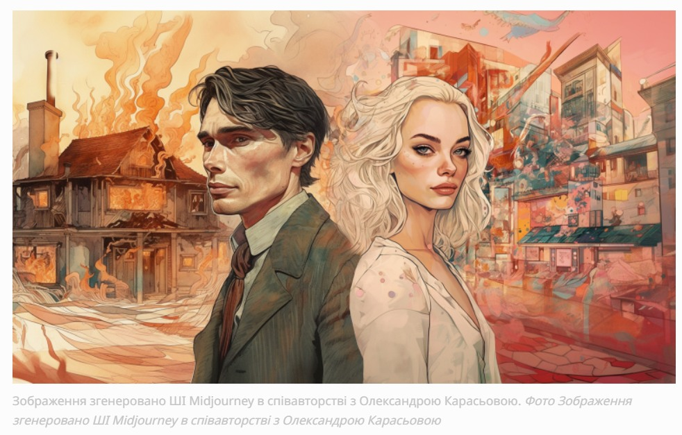

# Маркування зображень

Приклад підпису зображення у Forbes Ukraine: "Зображення згенеровано ШІ Midjourney в співавторстві з Олександрою Карасьовою".

  
Якщо ми приймаємо за аксіому, що у зв'язці людина-ШІ головною є людина, бо вона несе відповідальність за фінальний твір, то ім'я людини має все ж йти першим. До того ж, генерування зображень - це не співавторство, а використання інструменту. 

Якщо слідувати загальній логіці, яка вимагає вказувати всі інструменти та фактори, що впливали на створення твору, то підпис мав би бути щось на кшталт "NVIDIA, Windows, Кирило і Мефодій, Midjourney, карамельний лате на кокосовому молоці у співавторстві з Олександрою Карасьовою". Очевидно, це абсурд.

Однак маркування факту використання ШІ є правильним.

Тому можливими варіантами є:

- "Барбігеймер" (зображення створено за допомогою ШІ). Олександра Карасьова
- "Барбігеймер". Олександра Карасьова / Зображення створено за допомогою Midjourney
- "Барбігеймер". Олександра Карасьова / Зображення створено за допомогою Midjourney v.6

Таким чином, рекомендований формат:

"Назва або Короткий запит (промпт)". Автор(ка) / Інструмент або сервіс / Версія (опційно)
